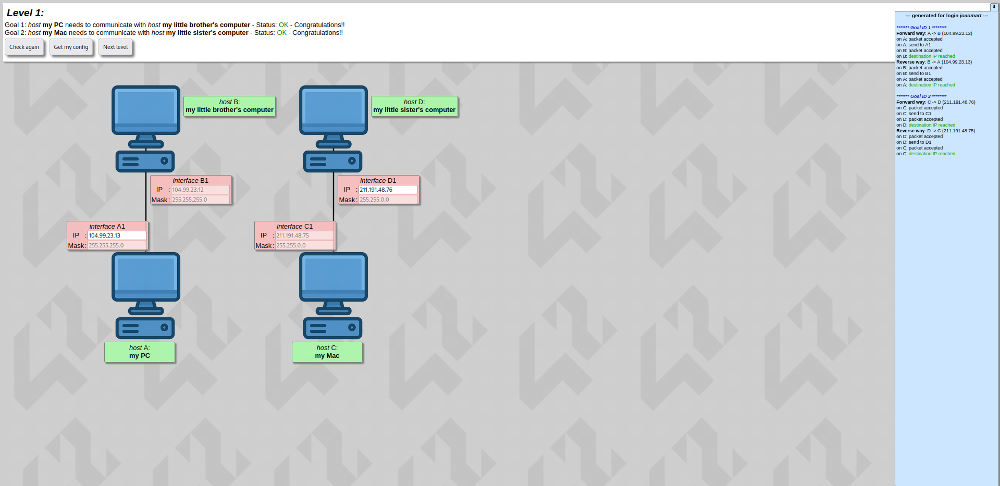
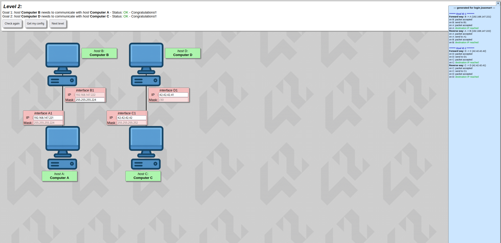
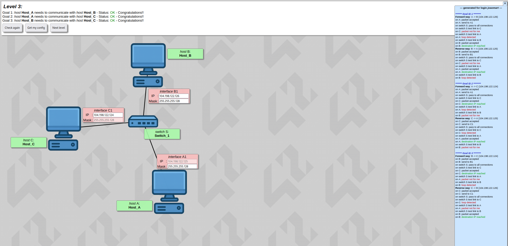
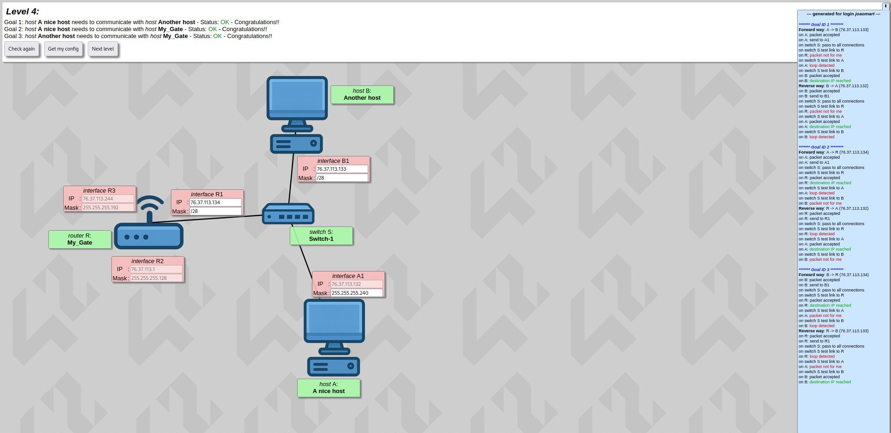
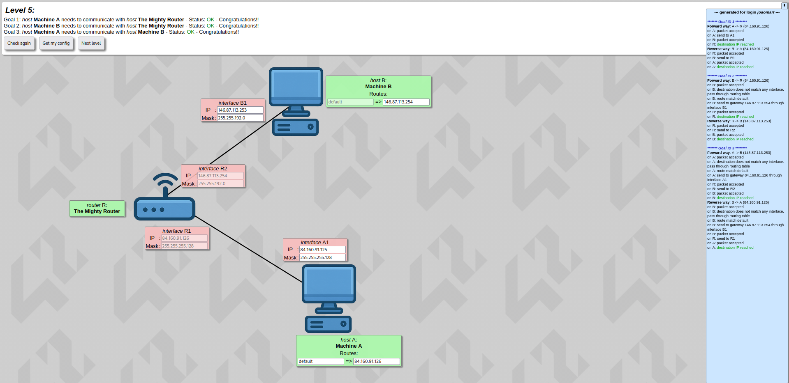
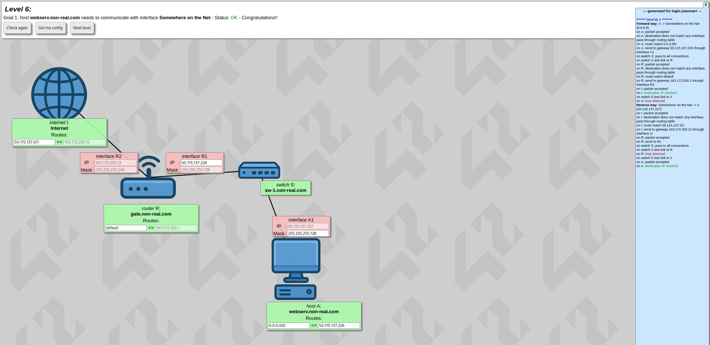
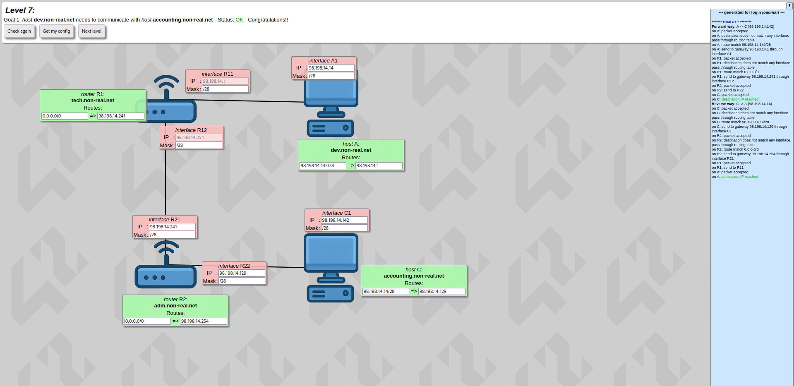
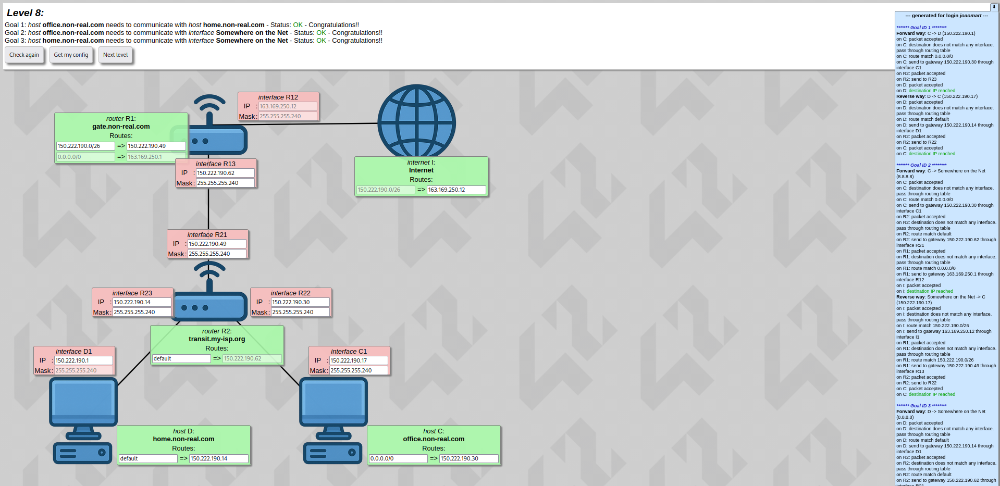
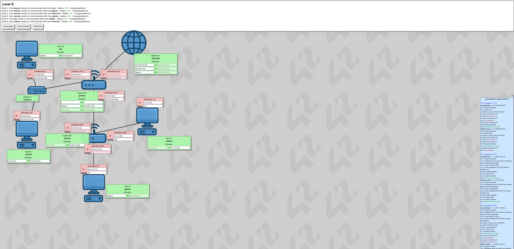
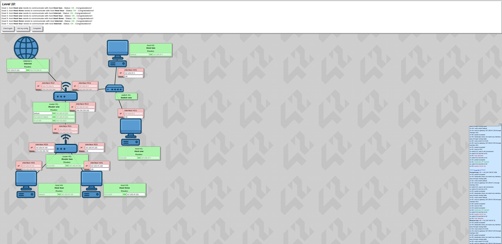

# 🌐 NetPractice

[Leia em Português](README.pt.md)

> A comprehensive networking configuration project from the **42 curriculum**, mastering TCP/IP addressing through 10 progressive hands-on levels.

---

## 📝 Description

**NetPractice** is a practical networking project where you solve real-world-style network configuration problems using a browser-based simulation interface. Each level presents a broken network topology — including hosts, switches, and routers — and your goal is to configure IP addresses, subnet masks, and routing tables correctly so that all communication goals are met.

The simulator provides **immediate feedback** on misconfigurations, making it an excellent learning tool for understanding how packets flow through networks.

---

## 🚀 Quick Start

### Prerequisites

- A modern web browser (Chrome, Firefox, Safari, Edge)
- Python 3.x (for running the local server)
- Your 42 intranet login credentials

### Running the Simulator

1. **Download the project files** from the 42 project page and extract them.

2. **Navigate to the project directory** and run the launch script:
   ```bash
   bash run.sh
   ```

   If `run.sh` doesn't work, start the server manually:
   ```bash
   python3 -m http.server 49242
   ```

3. **Open your browser** and navigate to:
   ```
   http://localhost:49242
   ```

4. **Enter your 42 login** to generate personalized configurations for each level.

---

## 📊 Levels Overview

| Level | Concept | Difficulty | Focus |
|:-----:|---------|:----------:|-------|
| **1** | Basic IP Addressing | ⭐ | Two isolated host pairs on separate networks |
| **2** | CIDR Subnet Masks | ⭐ | Introduction to `/30`, `/29`, `/28` notation |
| **3** | Switch & Shared Subnet | ⭐ | One switch connecting multiple hosts |
| **4** | Router with Switch | ⭐⭐ | Router interface on a switched network |
| **5** | Default Gateway | ⭐⭐ | Hosts routing to external networks via gateway |
| **6** | Internet Routing | ⭐⭐ | Default route (`0.0.0.0/0`) to the Internet |
| **7** | Static Routing (2 Routers) | ⭐⭐⭐ | Inter-subnet communication through routers |
| **8** | Multi-Router + NAT | ⭐⭐⭐ | NAT/gateway setup with multiple routers |
| **9** | Complex Multi-Subnet | ⭐⭐⭐ | Multiple routers, subnets, and Internet access |
| **10** | Full Topology Integration | ⭐⭐⭐⭐ | 4 hosts, 2 routers, 1 switch, Internet — complete network |

---

## 📸 Visual Solutions

### Level 1 — Basic IP Addressing


### Level 2 — CIDR Subnet Masks


### Level 3 — Switch with Multiple Hosts


### Level 4 — Router with Switch


### Level 5 — Default Gateway


### Level 6 — Internet Routing


### Level 7 — Two-Router Static Routing


### Level 8 — Multi-Router + Internet


### Level 9 — Complex Multi-Subnet Topology


### Level 10 — Full Network Topology


---

## 🛠️ How to Solve

### Step-by-Step Approach

1. **Read the topology** — Identify all hosts, switches, routers, and the Internet.

2. **Analyze the goals** — Right side of the interface shows what communication must be possible.

3. **Identify the subnets** — Determine which devices should be on the same network based on the topology.

4. **Configure IP addresses**:
   - Each device on the same physical link must be in the same subnet.
   - Use a subnet mask appropriate for the number of devices on that link.
   - Assign sequential IPs within the valid host range.

5. **Set default gateways** — Hosts need to know which router interface to use to reach other networks.

6. **Configure routing tables** — Routers need entries for all destination networks they can reach.

7. **Validate** — Click **Check again** and review the logs. Fix any issues and retry.

8. **Export configuration** — Click **Get my config** and save the file before moving to the next level.

### Key Rules

| Rule | Example |
|------|---------|
| **Same physical link = same subnet** | If Host A and Router R1 are on the same switch, both must have IPs in the same `/24` network |
| **Router interfaces** | Each router interface needs an IP address in the subnet of the devices it connects to |
| **Default gateway** | A host's gateway is **always** the IP of the router interface on the same network |
| **Routing table destination** | Must be a network address (e.g., `192.168.2.0/24`, not a host IP) |
| **Next hop** | Must be the IP of a directly connected router interface |
| **Internet route** | Use `0.0.0.0/0` to represent all external traffic |

---

## 🧠 Key Concepts

### TCP/IP Addressing

- **IPv4 address structure** — 32 bits divided into 4 octets (e.g., `192.168.1.5`)
- **Subnet mask** — Determines which bits identify the network vs. the host
- **CIDR notation** — Shorthand for subnet masks (e.g., `/24` = `255.255.255.0`)
- **Network address** — First IP in a subnet; cannot be assigned to a host
- **Broadcast address** — Last IP in a subnet; used for network-wide messages
- **Valid host range** — All IPs between network and broadcast addresses

### Network Devices

| Device | Layer | Role | Example |
|--------|-------|------|---------|
| **Host** | L3 | End device that sends/receives traffic | Computer, server, printer |
| **Switch** | L2 | Connects devices on the same network | Forwards frames by MAC address |
| **Router** | L3 | Connects different networks | Forwards packets by IP address |
| **Internet** | L3 | Global network of networks | Represented by `0.0.0.0/0` |

### Routing Fundamentals

- **Static routing** — Administrator manually configures routes (used in this project)
- **Dynamic routing** — Routers automatically discover routes (OSPF, BGP, etc.)
- **Routing table entry** — `[Destination Network] → [Next Hop IP]`
- **Longest prefix match** — Routers select the most specific (longest) matching route
- **Default route** — Catch-all route for any traffic not matching a specific entry

---

## 📐 CIDR Reference Table

| CIDR | Netmask | Total IPs | Usable Hosts | Common Use |
|:----:|---------|:---------:|:------------:|-----------|
| `/31` | `255.255.255.254` | 2 | 2* | Point-to-point links (router-to-router) |
| `/30` | `255.255.255.252` | 4 | 2 | Small networks, serial links |
| `/29` | `255.255.255.248` | 8 | 6 | Small office, branch office |
| `/28` | `255.255.255.240` | 16 | 14 | Departmental network |
| `/27` | `255.255.255.224` | 32 | 30 | Building, floor |
| `/26` | `255.255.255.192` | 64 | 62 | Large office |
| `/25` | `255.255.255.128` | 128 | 126 | Campus building |
| `/24` | `255.255.255.0` | 256 | 254 | Small organization, subnet |
| `/23` | `255.255.254.0` | 512 | 510 | Organization |
| `/22` | `255.255.252.0` | 1024 | 1022 | Multiple departments |

*For `/31`, both IPs are usable (RFC 3021 — point-to-point links)

### Quick CIDR Calculation

To find the **number of usable hosts** from a CIDR notation:
```
Usable Hosts = 2^(32 - CIDR) - 2
```

Examples:
- `/24`: 2^(32-24) - 2 = 2^8 - 2 = 256 - 2 = **254 hosts**
- `/28`: 2^(32-28) - 2 = 2^4 - 2 = 16 - 2 = **14 hosts**
- `/30`: 2^(32-30) - 2 = 2^2 - 2 = 4 - 2 = **2 hosts**

---

## 🔍 Troubleshooting Guide

### Packets Not Reaching Destination?

Follow this diagnostic checklist in order:

#### 1. **Check Host Configuration**
```
✓ Host IP is within the subnet defined by its netmask?
✓ Host netmask is correct?
✓ Host has a default gateway configured?
```

**Fix:** Recalculate the subnet range. Use a subnet calculator if unsure.

#### 2. **Verify Gateway Connectivity**
```
✓ Gateway IP exists on a router interface?
✓ Gateway IP is on the same subnet as the host?
✓ Router interface is activated and configured?
```

**Fix:** Ensure the router interface has an IP in the same subnet as the host.

#### 3. **Check Routing on Source Router**
```
✓ Router has a route to the destination network?
✓ Route points to a valid next hop?
✓ Next hop is reachable via a directly connected interface?
```

**Fix:** Add a routing table entry for the destination network.

#### 4. **Check Routing on Intermediate Routers**
```
✓ All routers between source and destination have necessary routes?
✓ Each route points to the next router in the path?
✓ Routers are properly connected?
```

**Fix:** Trace the path and ensure each router knows how to reach both source and destination.

#### 5. **Check Return Path** ⚠️ Most Common Issue
```
✓ Destination network has a route back to source?
✓ Return route is correct?
```

**Fix:** Routers near the destination must have routes back to the source network. This is often forgotten!

### Common Issues

| Issue | Cause | Solution |
|-------|-------|----------|
| "Host unreachable" | No route on router | Add route to routing table |
| "Network unreachable" | Wrong gateway or netmask | Verify host is in same subnet as gateway |
| Asymmetric communication | Missing return route | Add route back to source on destination-side router |
| "Packet dropped" | Interface not configured | Assign IP to all router interfaces |
| Internet unreachable | No default route | Add `0.0.0.0/0` route pointing to ISP gateway |

---

## 📦 Project Structure

```
.
├── README.md              # This file
├── level1.json            # Level 1 configuration (exported)
├── level2.json            # Level 2 configuration (exported)
├── level3.json            # Level 3 configuration (exported)
├── level4.json            # Level 4 configuration (exported)
├── level5.json            # Level 5 configuration (exported)
├── level6.json            # Level 6 configuration (exported)
├── level7.json            # Level 7 configuration (exported)
├── level8.json            # Level 8 configuration (exported)
├── level9.json            # Level 9 configuration (exported)
└── level10.json           # Level 10 configuration (exported)
```

---

## 📚 Resources

### Learning Materials

- **[Cisco Networking Basics — TCP/IP](https://www.cisco.com/c/en/us/solutions/small-business/resource-center/networking/networking-basics.html)** — Foundational TCP/IP concepts
- **[Professor Messer — Subnetting](https://www.professormesser.com/network-plus/n10-008/n10-008-video/classful-subnetting-n10-008/)** — Clear subnetting explanation
- **[RFC 791 — Internet Protocol](https://www.rfc-editor.org/rfc/rfc791)** — Official IPv4 specification
- **[RFC 3021 — Using 31-Bit Prefixes on IPv4 Point-to-Point Links](https://www.rfc-editor.org/rfc/rfc3021)** — Why `/31` works

### Tools

- **[Subnet Calculator](https://www.subnet-calculator.com/)** — Interactive CIDR/subnet calculations
- **[ipcalc](http://jodies.de/ipcalc)** — Command-line IP calculator
- **[Cisco IOS Routing Fundamentals](https://www.cisco.com/c/en/us/support/docs/ip/routing-information-protocol-rip/13788-3.html)** — Routing table concepts

### Wikipedia

- **[CIDR — Classless Inter-Domain Routing](https://en.wikipedia.org/wiki/Classless_Inter-Domain_Routing)**
- **[Subnet — Subnetwork](https://en.wikipedia.org/wiki/Subnetwork)**
- **[OSI Model](https://en.wikipedia.org/wiki/OSI_model)**
- **[Longest Prefix Match](https://en.wikipedia.org/wiki/Longest_prefix_match)**

---

## ⚙️ Evaluation Notes

During **peer evaluation**, you will be asked to solve **3 random levels** live within a time limit. Key points:

- ✅ **No external tools** allowed except a simple calculator (e.g., `bc` or system calculator)
- ✅ **All configuration files** must be in the repository root (`level1.json` through `level10.json`)
- ✅ **Screenshots** (imgs folder) are optional but helpful for reference
- ✅ **This README** serves as your study guide during defenses
- ✅ **Understanding > memorization** — Evaluators may ask you to explain your configuration choices

---
